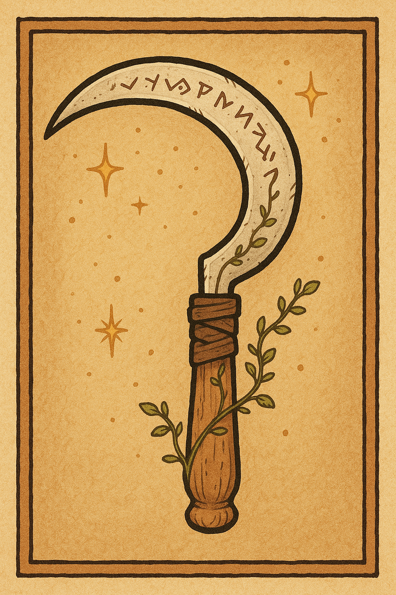

# SiRPG Introduction

SiRPG -the Simple RPG- is an experimental table top RPG, which focusses on ease of use and applicability to many different game setting.
It consists of different modules which can be used independently of each other and may be integrated into other games as well.

# Moule 1: The Character Sheet

A character has different **attributes** and **professions**, which are summarized in the character sheet.
Each entry in the character sheet is quantified by a number.

A character has four **attributes**:

- **Fitness** describes how strong, fast and enduring a character is.
- **Agility** describes the fine motoric skills and dexterity of the character.
- **Intelligence** describes the intelligence and knowledge of a character.
- **Charisma** describes the empathic skills and the overall charisma of a character.

Next, a character has one ore more **professions** which the player can choose freely.
Professions can be viewed as classes, like *detective* or *battlefield medic*.
Note that there are no scores for individual skills, but each professions implcitly covers a whole set of skills.

Be as precise as possible when describing your **profession** and maybe add a sentence to describe what you actually mean.
A generic *warrior* which provieds no further explanation leaves it unlear if this person can use a sword or a laser gun,
if he has any experience commanding troops or organizing logisitics.
Making your character instead a *sword master* who fights in battles and teaches the young nobility how to be knights clears up what the character can do.

## Character Creation

Initially, a player assignes the numbers -1, 0, 1, 2 to his **attributes** as he or she wishes.
The player then chooses one **profession** and gives it a score of two.

The character's initial **hitpoints** are then set as 10 plus the fitness score.

## Leveling up

When the players accieved an important milestone in the story, they can level up their characters.
Each player can improve one of his his attribute or profession scores by one.
If he choses to improve his fitness score, also his hitpoints are increased by one.
Then each player rolls 1D6 and adds that result to their hitpoints.

New professions can be aquired at any time.
For this, just write down the profession you are interested in learning and give it an intitial value of zero.
You can now start to use it, intially without benefit for the action but with the possibility to learn by leveling up.

## Using Skills

To determine the success of an in game action, the player rolls a D20 and adds the score of his most relevant attribute and of the highest applicable profession.
If no profession is applicable, add zero.
Every skill check has to make a reasonable assumption whether a profession applies to the situation.
The result has then to be greater or equal a given threshold for the action to succeed.
The threshold can be either fixed for a static obstacle or an opposing skill check for a competition against another character.

### Using Equipment and the Environment

Using equipment can help you accieve a task.
You can use one piece of equipment in an action, for example a magnifying glass to look for hidden clues.
In this case you can add a bonus to your skill check.
Equipment can have a value for the bonus assigned to them.
With weapons and shields this will typically be an attack or defense bonus.
If equipment has no value specified, the bonus is one.

In some cases, also the environment can help you in your skill check.
Darkness can help you hide, a corner can help you take cover from enemy fire.
Every benefitial environmental factor gives you one bonus.

### The Formula

1D20 + Attribute + Profession + Equipment + Environment >= threshold

# Module 2: Special Abilities

Special abilities represent a way to play with magic or great skills.
A character can receive special abilities to increase it's uniqueness and improve an interesting play style.
A player can invent new special abilities, and choose one during character creation.
They too are noted in the players character sheet.
Some abilities can level up to grant more bonuses, so instead of investing level points into attributes and professions, they can be invested into those abilities.

## Example Abilities

### Civilian Abilities

**Speechcraft Expert**
 - applies to skill checks in the context of talking
 - e.g. persuading, charming or tricking someone, negotiating for better prices, ...
 - once per scene you can reroll a failed skill check

**Tech Expert**
 - applies to skill checks in the context of using machinery
 - e.g. repairing a broken engine, crafting a new weapon, ...
 - once per scene you can reroll a failed skill check

**Sportive**
 - applies to skill checks in the context of performing sportive acts
 - e.g. climbing a wall, running, jumping
 - once per scene you can reroll a failed skill check

**Helpful**
 - When another player rolls a skill check, you can add one of your fitting attributes or professions to his result.
 - Applicable only in situations which are calm enough, so for example not in fights.

### Fighting Abilities

**Dual Wielding**
 - make an attack with your second weapon in your other hand right after your first attack
 - lvl 1 attack again after you land a hit with your first weapon
 - lvl 2 attack again after each attack with your first weapon

**Long Weapon Master**
 - make a second attack with your two handed weapon right after your first attack
 - lvl 1 attack again after you land a hit
 - lvl 2 attack again after each attack

**Dodge Master**
 - instead of using your armour class to determine if an attack hits you, you can choose to roll a skill check to dodge
 - your "armour class" for that incoming hit is a skill check using the agility attribute and any plausible profession, e.g. boxer or ninja
 - for ease of use, you can define your armour class by using 10 (base armour class) + agility + profession

### Magic Abilities

Casting magic is one of the most fascinating special abilities.
Leveling it up can give you additional spell points and access to higher level spells.
You can find extensive lists of spells in other sources.

An alternative approach is to choose an individual spell, and leveling up makes this spell stronger.
Your fireball would make more damage, you could teleport over a longer distance, or anything you can think of.
A destructive spell could be treated like a weapon of the same level, see below.

### Racial Abilities

Some fantasy races have different properties than humans:
They might for example be able to see in the dark or breathe under water.

# Module 3: Weapons and Armour

## Weapons
Weapons can be categorized into five tiers:

 - **Tier 0** bare hands
 - **Tier 1** improvized weapons: sticks, stones, bottles
 - **Tier 2** small weapons: knives, slingshots, throwing stars. They can be build quickly out of simple materials.
 - **Tier 3** one handed weapons: rapiers, pistols, axes
 - **Tier 4** two handed weapons: longswords, muskets, halbeards, longbows

Each tier gives a weapon that many points to distribute to the four weapon stats:
 - **Accuracy** Added attack bonus. Add points here if the weapon is easy to aim or can damage through armour.
 - **Damage** Added damage bonus. Add points here if the weapon is sharp.
 - **Defense** Added armour class bonus. Add points here if the weapon is good to block like a shield or a parrying dagger.
 - **Range** Ranged weapons must add one point here. Meele weapons still can add one point too, which allows the weapon to attack even if somebody is in between the attacker and the target.

If a weapon is a special artifact, masterly crafted or magical, it gains one point which can be added to its stats.
If the weapon is rusty or cursed, you can subtract a point from its stats.

### Attacking with a Weapon

Attacking is a skill check.
A weapon which requires muscle force to deliver the attack uses the fitness attribute.
Breaking with role playing tradition, this definition also includes bows.
If the weapons attack instead triggers without the use of force, and the user can instead focus on aiming,
agility or intelligence can be used as relevant attributes.

The **accuracy** value of a given weapon is added as the equipment modifier to the above skill check formula.
If the attack succeeds, the damage is 1d6 + the **damage** attribute of the weapon.

### Example Weapons

| Name   | Tier | Attr | rng | acc | dmg | def |
|--------|------|------|-----|-----|-----|-----|
| Sickle | T2, meele | fitness | 0 | 1 | 1 | 0 |
| Shield | T3, meele | fitness | 0 | 0 | 0 | 3 |
| Parrying Dagger | T2, meele | fitness | 0 | 0 | 1 | 1 |
| Halbeard | T4, meele | fitness | 1 | 0/2* | 2/0* | 1 |
| Musket | T4, range | agility | 1 | 2 | 1 | 0 |

* The halbeard can be used with the axe head for a **damage** bonus and the hammer head for an **accuracy** bonus.
* Note that shields count also as weapons. All their points go into the **defense** attribute, but attacking with them is still possible.

## Armour

An unarmoured character has a base **armour class** of 10. This is the threshold for an attack skill check to hit.
If a character carries a shield or a weapon with a **defense** attribute in his hands, this value is added to the characters **armour class**.
If a character wears pieces of armour, their **defense** values are also added to the characters **armour class**.

Armour can be classified into categories with different **defense** values. 

| Category | Materials | Def | Examples |
|----------|-----------|-----|----------|
| light/soft | fabric, leather | 1 | gloves, jacket, boots |
| heavy/hard | metal | 2 | cuirass, helmet |
| energy based | technology or magic | 3 | shield generator, spell |


# Module 4: Vehicles

Vehicles can transport characters and goods, they can be mobile bases and they can fight each other.
The concept of vehicles can be applied to all game settings, and they can range from huge starships to sailing vessels to a small van or a donkey chart.

Different vehicles can be compared in these stats:

 - **Speed** in long range contests, higher speed wins
 - **Acceleration** in short range contests, higher acceleration wins
 - **Mass** indirectly proportional to maneuverability, in contests with a lot of obstacles lower mass wins

## Customizable Rooms

Big enough vehicles contain rooms which can be fitted to serve many purposes.
Use some of those examples or invent your own.

 - **Empty Room** good for storage
 - **Hidden Room** good for secret storage
 - **Cage** still empty, but with bars. Good for animals or prisoners
 - **Hospital** heal your friends, access medicine and craft potions here
 - **Workshop** fitted with tools, repair the vehicle and craft items
 - **Reactor/ Magic Artifact** power shields, life support, etc
 - **Water Filter Room** turn salt water drinkable, good for sailing the oceans
 - **Luxury Cabin** very cozy.
 - **Additional Move Speed** In the form of additional rows or engines
 - **Landing Bay** for smaller vessels
 - **Cannon Bay** contains a big gun and it's amunition

Additionaly to rooms, some vehicles like ships and pickup trucks have a deck area which can be fitted with other equipment:

 - **Cannon** Very heavy weapon, you might want to model it as a tier 5 or 6 weapon
 - **Boarding Bridge** When closing in to another vehicle, this bridge can be lowered and hooked into the opponent vehicle
 - **Sails / Solar Power Array** more power or speed

## Designing Sailing Ships

Specifically for pirate themed games, this can be a useful system to design sailing ships and derive their properties from that design.
A ship consists of three diferent elements, **foundations**, **rooms**, and **masts**.
They will be drawn on sqared paper and represent a 2D ship.

Start by laying out **foundation** elements in a line as the top deck of the ship. Foundations define the length of your ship.

Under the deck you can attach **rooms**. To place a room, it needs three foundations or other rooms on the layer over it.
So the design will grow from the foundation layer downwards in a triangular shape. Rooms can also be placed on top of a foundation element.
Rooms can then be used as in the above examples.

Lastly add **masts** on top of the foundation. Starting with the first foundation element every second foundation can have a mast.
Every mast can be as many elements high, as there are room and foundation elements under it.
The first mast can be displayed as front facing instead of going straight up.
Masts and their attached sails generate the force to move the ship.

The result might look like this:

```
  |
# |    /
- - - -
  # #
```

To derive the attributes of the ship, we can calculate:

 - **Mass** is the sum of all used elements, each mast and foundation element having a mass of 1 and each room having a mass of 4
 - **Acceleration** is the fraction of the applied force divided by the mass of the moving object. Each used mast element generates 1 force.
 - **Speed** interestingly longer ships can move faster as the water moves more efficiently around longer hulls. The maximum speed is the acceleration times the length, which is the amount of foundation elements.

## Sailing Ship Customization

Sailing ships can attach a figure to the front, which can grant a unique bonus to the crew or the to the ship itself.
Here are some suggestions:

 - **Scary Skeleton** +1 bonus to all fighting skill checks of the crew
 - **Charming Mermaid** +1 bonus to all social interactions of the crew
 - **Ripof of an Expensive Car Brands Logo** adds speed, counts as one sail element without the weight
 - **Stylish Dragon Sculpture** sea dragons won't attack this ship
